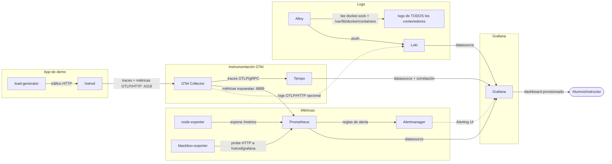

# Curso SRE + Observabilidad — laboratorio on-premise completo

Stack Docker Compose con todos los componentes usados en el curso de SRE y
Observabilidad: métricas (Prometheus + exporters + Alertmanager),
visualización (Grafana), logs centralizados (Loki + Alloy), trazas
distribuidas (Tempo) y el pipeline de instrumentación estándar
(OpenTelemetry Collector) — todo on-premise, sin depender de ningún SaaS.

Incluye además una app de demo ya instrumentada (**hot-rod**, de Jaeger) y
un generador de tráfico automático, para tener métricas/logs/trazas reales
desde el primer minuto sin tener que programar nada.

## Componentes que se arrancan

| Servicio | Rol | Bloque del temario |
|---|---|---|
| `node-exporter` | métricas del sistema (CPU, RAM, disco, red) del host | 3. Prometheus |
| `blackbox-exporter` | prueba disponibilidad HTTP de endpoints (hot-rod, Grafana) | 3. Prometheus |
| `prometheus` | almacena métricas, evalúa reglas de alerta, PromQL | 3. Prometheus |
| `alertmanager` | enruta/agrupa alertas de Prometheus | 3. Prometheus / 6. Incidentes |
| `grafana` | dashboards + alertas + correlación métricas↔logs↔trazas | 4. Grafana |
| `loki` | almacén de logs (etiquetado, no full-text index) | 5. Logging |
| `alloy` | recolecta y etiqueta logs de todos los contenedores + del host | 5. Logging |
| `tempo` | almacén de trazas distribuidas | 5. Trazas |
| `otel-collector` | pipeline único OTLP → Tempo (trazas) / Prometheus (métricas) / Loki (logs) | 2. OTel |
| `hotrod` | app de ejemplo de Jaeger, instrumentada con OTel, genera trazas reales | 2. OTel / 5. Trazas |
| `load-generator` | bombardea `hotrod` con tráfico sintético en bucle | soporte para todos los talleres |
| `dashy` | portal unificado de acceso rápido y estado de servicios (`:4000`) | Soporte general / Portal |
| `caddy` | solo redirige los enlaces "find trace" de hot-rod (`localhost:16686/trace/<id>`) al Explore de Grafana/Tempo; sin TLS (el TLS está en el ejemplo 47) | soporte para Trazas |

No hay imagen "de aplicación propia" que instrumentar a mano en clase: se
puede usar `hotrod` como caso ya resuelto para explorar Grafana/Tempo/Loki,
y como referencia de instrumentación OTel real (ver sus logs de arranque).

## Diagrama de flujo de datos

Cómo circula cada tipo de señal (métricas, logs, trazas) entre los
contenedores, de la fuente hasta Grafana:



- Las **flechas continuas** son el flujo normal en marcha desde el arranque.
- La flecha punteada `OTC -.-> LOKI` es el camino opcional para logs enviados
  directamente por OTLP (en vez de vía Alloy) si en algún taller se
  instrumenta una app propia.
- `blackbox-exporter` no scrapea nada por sí mismo: Prometheus le pide
  "compruébame esta URL" (`http://hotrod:8080`, `http://grafana:3000/login`)
  y él hace el `GET` y devuelve `probe_success`.

## Primeros pasos

```bash
cd compose/46_curso_sre_observabilidad
./00_init.sh            # (solo la primera vez) crea carpetas de datos y compose.env con password de Grafana
./01_launch_compose.sh   # levantar todo
./02_ps_compose.sh       # ver estado
./03_logs_compose.sh [servicio]  # ver logs (por defecto todos)
./04_exec_compose.sh <servicio> [comando]  # shell dentro de un contenedor (sh por defecto)
./05_stop_compose.sh     # parar (sin borrar datos)
./06_start_compose.sh    # volver a arrancar tras un stop
./20_destroy.sh          # borrar TODO (contenedores + datos + compose.env), pide confirmación
```

## URLs de acceso

- **Portal (Dashy)**: http://localhost:4000 — portal central con enlaces y comprobaciones de estado de todos los servicios del laboratorio
- **Grafana**: http://localhost:3030 (usuario `admin`, password generada por `00_init.sh` — ver `compose.env` o la salida de `01_launch_compose.sh`)
- **Prometheus**: http://localhost:9090
- **Alertmanager**: http://localhost:9093
- **Loki API**: http://localhost:3100 (sin UI propia, se consulta desde Grafana)
- **Alloy UI**: http://localhost:12345 (grafo del pipeline de logs y estado de sus componentes)
- **Tempo API**: http://localhost:3200 (sin UI propia, se consulta desde Grafana)
- **Blackbox Exporter**: http://localhost:9115
- **hot-rod (demo app)**: http://localhost:8082 — botones para simular pedidos, cada clic genera una traza distribuida real

Grafana ya trae provisionados (sin tocar nada) los datasources de
Prometheus, Loki y Tempo, con la correlación activada: desde una traza en
Tempo puedes saltar a los logs de ese mismo periodo en Loki, y desde ahí a
las métricas en Prometheus (bloque 5, "Correlación de señales").

## Cómo ver todo esto en Grafana (guía rápida)

Todo llega ya conectado (datasources + dashboard provisionados), pero conviene
saber dónde mirar cada cosa la primera vez que entras:

1. **Dashboard de infraestructura** — menú lateral **Dashboards** → carpeta
   **Curso SRE** → **Infraestructura - Node Exporter**. CPU, memoria, disco,
   red y disponibilidad de endpoints, con datos reales del host desde el
   arranque. Si algún panel aparece vacío, casi siempre es el selector de
   rango de tiempo (arriba a la derecha) — pon **Last 15 minutes** si el
   stack lleva poco arriba.

2. **Métricas sueltas (PromQL)** — menú **Explore**, datasource **Prometheus**
   (selector arriba a la izquierda del panel). Escribe una métrica, por
   ejemplo `up`, y pulsa **Run query** (botón azul arriba a la derecha, o
   `Shift+Enter` con el cursor en el editor) — Grafana no ejecuta la consulta
   solo con escribirla.

3. **Logs (LogQL)** — **Explore** → datasource **Loki** → query
   `{container="hotrod"}`. Cada línea de log de `hotrod` incluye su
   `trace_id`, clave para el paso 5.
   - Alternativa sin escribir LogQL a mano: menú **Drilldown → Logs**
     (`/drilldown`), elige datasource Loki y te lista los `container`
     disponibles (`hotrod`, `grafana`, `prometheus`, `otel-collector`...)
     para ir filtrando a clics.

4. **Trazas** — **Explore** → datasource **Tempo** → pestaña **Search** →
   filtra por `Service Name = frontend` (o pega un `trace_id` visto en Loki).
   Verás el árbol de spans de una petición real de `hotrod`.

5. **Correlación traza → log → métrica** — abre una traza en Tempo, cada span
   tiene un botón **Logs for this span** que te lleva directo a Loki filtrado
   por ese `trace_id` y esa ventana de tiempo exacta (bloque 5 del temario,
   "Correlación de señales").

## Cómo mapear cada taller del temario a este entorno

### Bloque 3 — Prometheus
- Arquitectura ya desplegada: `prometheus` + `node-exporter` (sistema) +
  `blackbox-exporter` (endpoints) + `alertmanager`.
- PromQL: usar la pestaña **Explore** de Prometheus o Grafana contra
  `node_cpu_seconds_total`, `node_memory_MemAvailable_bytes`, `probe_success`, etc.
- Reglas de alerta ya definidas en `config/alert_rules.yml` (instancia caída,
  CPU alta, disco casi lleno, endpoint caído) — puedes dispararlas en clase
  parando `node-exporter` (`docker compose stop node-exporter`) o generando
  carga de CPU en el host.
- Enrutado en `config/alertmanager.yml` (receiver `default`; hay ejemplos
  comentados de webhook/email/Slack para configurar en el taller).

### Bloque 4 — Grafana
- Datasource Prometheus ya conectado.
- Dashboard de referencia ya provisionado: **Curso SRE → Infraestructura -
  Node Exporter** (CPU, memoria, disco, red, disponibilidad de endpoints) —
  úsalo como punto de partida y pide a los alumnos que añadan paneles nuevos
  (p.ej. tasa de peticiones/errores de `hotrod` vía sus métricas OTel).
- Canales de notificación: **Alerting → Contact points** en la propia UI de
  Grafana (email/Slack/webhook), independientes de los de Alertmanager.

### Bloque 5 — Logging y Trazas
- Loki + Alloy ya recolectan **los logs de todos los contenedores de este
  mismo compose** (etiquetados por nombre de contenedor) — en Grafana, pestaña
  **Explore → Loki**, prueba `{container="hotrod"}`.
- LogQL: filtra por label, por texto (`|= "error"`), agrega con
  `count_over_time(...)`.
- Trazas: entra en http://localhost:8082, pincha varias veces en "Request",
  y busca las trazas resultantes en Grafana → **Explore → Tempo** (o desde el
  propio panel de Node Graph / Service Graph, generado automáticamente por
  Tempo a partir de esas trazas).
- Taller de correlación: parte de una traza lenta en Tempo → botón "Logs for
  this span" → aterrizas en Loki filtrado a ese `trace_id` y esa ventana de
  tiempo exacta.

### Bloque 6 — Gestión de incidentes
- Simulación de incidente: parar `node-exporter` o `hotrod`
  (`docker compose stop hotrod`) dispara `InstanceDown`/`EndpointNoResponde`
  en Prometheus → aparece en Alertmanager (http://localhost:9093) → se puede
  ver también en Grafana Alerting.
- Practicar el ciclo completo: detección (alerta) → clasificación (severity
  del `alert_rules.yml`) → respuesta (`docker compose start <servicio>`) →
  redacción de post-mortem con las capturas de Grafana/Prometheus/Alertmanager
  como evidencia (MTTD = hora de la alerta - hora del corte real; MTTR = hora
  de vuelta a verde - hora de la alerta).

## Notas de la instalación

- Todos los datos persistentes son bind mounts locales, unificados bajo
  `./volumes/<servicio>/data` (`volumes/prometheus/data`,
  `volumes/alertmanager/data`, `volumes/loki/data`, `volumes/tempo/data`,
  `volumes/grafana/data`) — no volúmenes con nombre. Una carpeta por
  servicio y, dentro, una por cada volumen que necesite (de momento todos
  tienen solo `data`, pero deja sitio para añadir más si algún servicio lo
  necesitara).
- `otel-collector` usa la imagen `-contrib` (no la mínima) porque el
  exporter de Loki solo está en esa variante.
- `alloy` (Grafana Alloy, sustituto oficial de Promtail, fin de vida el
  2-mar-2026) necesita acceso al socket de Docker (`/var/run/docker.sock`,
  solo lectura) para descubrir los contenedores vía `discovery.docker` —
  sin eso no encuentra ningún log. Su configuración está en
  `config/config.alloy` y mantiene las etiquetas `container`, `stream` y
  `job="syslog"`. Su UI (grafo del pipeline y estado de cada componente)
  está publicada en http://localhost:12345, útil para depurar en clase.
- `hotrod` se lanza con `--otel-exporter=otlp` apuntando al puerto **HTTP**
  del collector (`OTEL_EXPORTER_OTLP_ENDPOINT=http://otel-collector:4318`,
  `OTEL_EXPORTER_OTLP_PROTOCOL=http/protobuf`) — apunta por defecto al de
  gRPC (4317) y el handshake falla con "malformed HTTP response". Si tu
  versión de la imagen cambia este comportamiento, revisa sus logs de
  arranque (`./03_logs_compose.sh hotrod`) y ajusta el `command:`/`environment:`
  en `compose.yaml`.
- Se fija `tempo:2.6.1` (no `latest`) porque Tempo 3.x rehízo la
  configuración monolítica (`ingester`/`compactor` sustituidos por
  `backend-scheduler`/`block-builder`) y rompe `config/tempo.yaml`.
- Todos los puertos quedan publicados en el host (no hay red aislada) para
  poder acceder a cada UI directamente durante las clases; en un despliegue
  real del CPD, limita esto con firewall/reverse proxy según corresponda.
