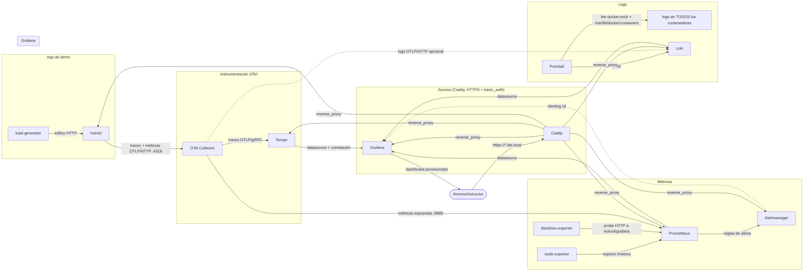

# Curso SRE + Observabilidad — laboratorio on-premise completo (con TLS y control de acceso)

Misma base que [`46_curso_sre_observabilidad`](../46_curso_sre_observabilidad/README.md):
métricas (Prometheus + exporters + Alertmanager), visualización (Grafana),
logs centralizados (Loki + Promtail), trazas distribuidas (Tempo) y el
pipeline de instrumentación estándar (OpenTelemetry Collector) — todo
on-premise, sin depender de ningún SaaS.

Incluye además una app de demo ya instrumentada (**hot-rod**, de Jaeger) y
un generador de tráfico automático, para tener métricas/logs/trazas reales
desde el primer minuto sin tener que programar nada.

> **Comparación didáctica de agentes:** este ejemplo 47 conserva Promtail
> porque es el agente incluido en el temario. Promtail llegó al fin de vida el
> 2 de marzo de 2026; no se recomienda para instalaciones nuevas. El ejemplo
> [46](../46_curso_sre_observabilidad/README.md) ofrece el mismo laboratorio de
> logs con Grafana Alloy, alternativa mantenida. Usa el 47 para seguir el
> contenido del temario y el 46 para comparar la opción vigente.

**Diferencia con el 46**: además de los servicios, hay un reverse proxy
(Caddy) delante con TLS autofirmado (CA local propia) y `basic_auth`, para
poder comparar lado a lado el stack "sin asegurar" (46) y el "asegurado"
(este). Por ahora los puertos directos de cada servicio siguen abiertos junto
a Caddy; se cerrarán en la última fase del plan (ver
[Seguridad: TLS y control de acceso](#seguridad-tls-y-control-de-acceso)).
El plan completo está en [PLAN.md](PLAN.md).

## Componentes que se arrancan

| Servicio | Rol | Bloque del temario | URL directa | URL vía Caddy (HTTPS) | Credenciales |
|---|---|---|---|---|---|
| `dashy` | portal unificado de acceso y estado | Soporte / Portal | `http://localhost:4000` | `https://portal.lab.local` | Directo: ninguna / Caddy: `curso` (ver `caddy.env`) |
| `grafana` | dashboards + alertas + correlación | 4. Grafana | `http://localhost:3030` | `https://grafana.lab.local` | `admin` (ver `compose.env`) |
| `prometheus` | servidor central de métricas y PromQL | 3. Prometheus | `http://localhost:9090` | `https://prometheus.lab.local` | Directo: ninguna / Caddy: `curso` (ver `caddy.env`) |
| `alertmanager` | enrutamiento de alertas | 3. Prometheus / 6. Incidentes | `http://localhost:9093` | `https://alertmanager.lab.local` | Directo: ninguna / Caddy: `curso` (ver `caddy.env`) |
| `loki` | almacén central de logs estructurados | 5. Logging | `http://localhost:3100` (API) | `https://loki.lab.local` | Directo: ninguna / Caddy: `curso` (ver `caddy.env`) |
| `alloy` | recolector unificado OpenTelemetry (UI) | 5. Logging | `http://localhost:12345` (UI) | `https://alloy.lab.local` | Directo: ninguna / Caddy: `curso` (ver `caddy.env`) |
| `promtail` | recolector de logs (agente temario, EOL 2026) | 5. Logging | *(red interna de Docker)* | *(red interna de Docker)* | Sin interfaz web |
| `tempo` | almacén de trazas distribuidas | 5. Trazas | `http://localhost:3200` (API) | `https://tempo.lab.local` | Directo: ninguna / Caddy: `curso` (ver `caddy.env`) |
| `otel-collector` | pipeline único OTLP | 2. OTel | `http://localhost:8889/metrics` | *(sin vhost)* | Sin autenticación |
| `hotrod` | app de demostración con trazas OTLP | 2. OTel / 5. Trazas | `http://localhost:8082` | `https://hotrod.lab.local` | Directo: ninguna / Caddy: `curso` (ver `caddy.env`) |
| `cadvisor` | métricas de contenedores del host | 3. Prometheus / Docker | *(sin puertos publicados)* | *(sin vhost)* | Sin interfaz directa |
| `node-exporter` | métricas de sistema del host | 3. Prometheus | `http://localhost:9100/metrics` | *(sin vhost)* | Sin autenticación |
| `blackbox-exporter` | comprobación de disponibilidad HTTP | 3. Prometheus | `http://localhost:9115` | *(sin vhost)* | Sin autenticación |
| `caddy` | reverse proxy TLS y auth básica | Seguridad | `http://localhost:80` / `:443` | `https://*.lab.local` | `curso` (ver `caddy.env`) |
| `load-generator` | genera tráfico sintético continuo | Soporte para talleres | *(proceso interno en bucle)* | *(sin interfaz)* | Sin interfaz |

### Dónde consultar las contraseñas generadas

Cada ejecución de `./00_init.sh` genera contraseñas aleatorias nuevas y las guarda en ficheros locales excluidos de Git:

1. **Contraseña de Grafana (`admin`):**
   - Fichero: `compose.env`
   - Variable: `GF_SECURITY_ADMIN_PASSWORD`
   - Comando rápido: `grep GF_SECURITY_ADMIN_PASSWORD compose.env`
2. **Contraseña de Caddy (`curso` — Prometheus, Alertmanager, Loki, Tempo, Alloy, Portal, Hot-Rod):**
   - Fichero: `caddy.env` (en el comentario superior `# Contraseña en claro: ...` o en la salida de `./00_init.sh`)
   - Comando rápido: `head -n 1 caddy.env`

No hay imagen "de aplicación propia" que instrumentar a mano en clase: se
puede usar `hotrod` como caso ya resuelto para explorar Grafana/Tempo/Loki,
y como referencia de instrumentación OTel real (ver sus logs de arranque).

## Diagrama de flujo de datos

Cómo circula cada tipo de señal (métricas, logs, trazas) entre los
contenedores, de la fuente hasta Grafana:



- Las **flechas continuas** son el flujo normal en marcha desde el arranque.
- La flecha punteada `OTC -.-> LOKI` es el camino opcional para logs enviados
  directamente por OTLP (en vez de vía Promtail) si en algún taller se
  instrumenta una app propia.
- Caddy solo es la puerta de entrada del navegador: Grafana consulta
  Prometheus, Loki y Tempo **por la red interna** de Docker, sin pasar por
  Caddy y sin necesitar las credenciales de `basic_auth`.
- `blackbox-exporter` no scrapea nada por sí mismo: Prometheus le pide
  "compruébame esta URL" (`http://hotrod:8080`, `http://grafana:3000/login`)
  y él hace el `GET` y devuelve `probe_success`.

## Primeros pasos

El `compose.yaml` raíz solo agrupa (con `include`) seis módulos, cada uno en
su propio fichero `compose.<módulo>.yaml`. Se pueden levantar **por fases**,
en el orden del temario, o todos de golpe.

```bash
cd compose/47_curso_sre_observabilidad_tls
./00_init.sh             # (solo la primera vez) crea carpetas de datos y compose.env con password de Grafana
```

### Arranque por fases

| Script | Módulo | Servicios | Se explica en |
|---|---|---|---|
| `./01_launch_metricas.sh` | `compose.metricas.yaml` | node-exporter, blackbox-exporter, Prometheus, Alertmanager | Bloque 3 |
| `./02_launch_logs.sh` | `compose.logs.yaml` | Loki, Promtail | Bloque 5 |
| `./03_launch_trazas.sh` | `compose.trazas.yaml` | Tempo, OTel Collector | Bloque 5 |
| `./04_launch_grafana.sh` | `compose.grafana.yaml` | Grafana | Bloque 4 |
| `./05_launch_demo.sh` | `compose.demo.yaml` | hot-rod, load-generator | soporte |
| `./06_launch_proxy.sh` | `compose.proxy.yaml` | Caddy (TLS autofirmado) | seguridad |
| `./07_launch_portal.sh` | `compose.portal.yaml` | dashy (portal de inicio y estado) | soporte / portal |

Cada módulo se puede lanzar solo, sin depender de los demás
(`docker compose --env-file compose.env -f compose.metricas.yaml up -d`), y
todos comparten el mismo proyecto y la misma red: da igual con cuál se
empiece. Los módulos no declaran `depends_on` entre sí; si arrancas Grafana
antes que Prometheus, simplemente verá el datasource caído hasta que este
suba (todos tienen `restart: always`).

`./07_launch_todo.sh` levanta todos los módulos de una vez (incluidos Alloy y Dashy).

### Gestión (sobre el conjunto de servicios ya creados)

```bash
./10_ps_compose.sh       # ver estado
./11_logs_compose.sh [servicio]  # ver logs (por defecto todos)
./12_exec_compose.sh <servicio> [comando]  # shell dentro de un contenedor (sh por defecto)
./13_stop_compose.sh     # parar (sin borrar datos)
./14_start_compose.sh    # volver a arrancar tras un stop
./15_docker_metrics.sh on|off  # recoger (o no) las métricas del demonio Docker del host (ver «Pasos manuales en el host»)
./20_destroy.sh          # borrar TODO (contenedores + datos + compose.env), pide confirmación
```

## Seguridad: TLS y control de acceso

**Qué hay:** Caddy termina TLS con certificados firmados por una CA local
propia (`tls internal`, sin Let's Encrypt: no hay dominio público), aplica
`basic_auth` a todo salvo Grafana (que tiene su propio login) y da un nombre
`*.lab.local` a cada servicio. Solo Caddy es la puerta de entrada prevista;
node-exporter, blackbox-exporter y otel-collector no tienen vhost.

**Cómo se usa, de cero a navegador** (lo que toca tu máquina está en
"Pasos manuales en el host"):

1. `./00_init.sh` → anota las dos passwords que imprime (Grafana y `curso`).
2. `./07_launch_todo.sh` (o los módulos por fases).
3. `./host/hosts.sh` y `./host/instalar_ca.sh` (ver «Pasos manuales en el host»).
4. Abre `https://grafana.lab.local`.

**Problemas típicos**

| Síntoma | Causa / solución |
|---|---|
| El navegador avisa de certificado no confiable | No has instalado la CA, o has recreado el entorno (`20_destroy.sh` borra `pki/` y `00_init.sh` crea una nueva): `./host/instalar_ca.sh` |
| `No se puede encontrar el servidor` en `*.lab.local` | Faltan las líneas de `/etc/hosts`: `./host/hosts.sh` |
| `401 Unauthorized` en Prometheus/Alertmanager/Loki/Tempo/hot-rod | Usa usuario `curso` y la password que imprimió `00_init.sh` (o borra `caddy.env` y vuelve a ejecutarlo) |
| `caddy` no arranca / `address already in use` | 80/443 ocupados en el host: cambia `CADDY_HTTP_PORT`/`CADDY_HTTPS_PORT` en `compose.env` (p. ej. 8081/8443), `./06_launch_proxy.sh`, y usa `https://…lab.local:8443` |
| El enlace "find trace" de hot-rod no abre nada | Caddy no está levantado (lo sirve en el 16686): `./06_launch_proxy.sh` |

**Solo para laboratorio.** Esto es válido para el entorno del curso. En un
despliegue real del CPD con dominio público, sustituye `tls internal` por el
emisor de Let's Encrypt de Caddy (cambio de una línea en el `Caddyfile`) y
considera Authelia/OIDC en vez de `basic_auth` si hay varios servicios con
sesión compartida. Una password común para todo el curso es una comodidad
didáctica, no un modelo de acceso para producción.

## Pasos manuales en el host

Estos pasos tocan **tu máquina** (fuera de Docker), por eso ningún script del
laboratorio los ejecuta por su cuenta: los lanzas tú. Están automatizados en
`host/`, con un comando cada uno; ambos son idempotentes y admiten `--quitar`.

### 1. Nombres `*.lab.local` en `/etc/hosts`

```bash
./host/hosts.sh              # apuntan a 127.0.0.1
./host/hosts.sh 10.0.0.5     # o a la IP de la máquina donde corre el stack
```

Añade un bloque delimitado (`# BEGIN/END curso-sre-lab`) usando `sudo`; si lo
ejecutas otra vez lo sustituye. Comprobación: `getent hosts grafana.lab.local`.
En Windows el fichero es `C:\Windows\System32\drivers\etc\hosts` (a mano,
editor como administrador).

### 2. Confiar en la CA local del laboratorio

`00_init.sh` genera una CA raíz propia en `pki/root.crt` (la clave,
`pki/root.key`, se queda en tu máquina y está en `.gitignore`); Caddy firma con
ella los certificados de los vhosts. Para que el navegador no avise de
certificado no confiable:

```bash
./host/instalar_ca.sh
```

Instala la CA en el almacén del sistema (`sudo`; Debian/Ubuntu y
Fedora/RHEL) y en las bases NSS de Chrome/Chromium y de los perfiles de
Firefox (normal, snap y flatpak). Necesita `certutil` para los navegadores
(`libnss3-tools` en Debian/Ubuntu, `nss-tools` en Fedora); sin él solo toca el
sistema. Reinicia el navegador después. Si prefieres hacerlo a mano, importa
`pki/root.crt` (Firefox: *Ajustes → Privacidad y seguridad → Certificados →
Ver certificados → Autoridades → Importar*; Chrome: *Ajustes → Privacidad y
seguridad → Seguridad → Administrar certificados → Autoridades → Importar*),
marcando «confiar para identificar sitios web».

**Cada `20_destroy.sh` borra también `pki/`**, así que tras `00_init.sh` hay
una CA nueva: vuelve a ejecutar `./host/instalar_ca.sh` (sustituye la
anterior). Para retirarla del todo: `./host/instalar_ca.sh --quitar`.

Comprobación sin navegador:

```bash
curl --cacert pki/root.crt --resolve grafana.lab.local:443:127.0.0.1 https://grafana.lab.local/login
```

### 3. Métricas del demonio Docker (opcional)

Para ver en Grafana el estado del propio Docker del host (dashboard *Docker
daemon metrics*: contenedores por estado, CPU/memoria del motor, acciones de
contenedores y de red) hay que exponer `metrics-addr` en el demonio y
decirle a Prometheus que lo recoja. Son dos pasos, uno en tu máquina y otro
en el proyecto:

```bash
./host/docker_metrics.sh      # 1) edita /etc/docker/daemon.json (con copia de seguridad)
sudo systemctl restart docker # 2) ⚠ ver aviso
./15_docker_metrics.sh on     # 3) Prometheus empieza a recogerlas (no toca el host)
```

`./host/docker_metrics.sh --reiniciar` hace 1 y 2 juntos; `--quitar` deshace
el cambio de `daemon.json`, y `./15_docker_metrics.sh off` desactiva el scrape.

> ⚠ **Reiniciar Docker para y arranca todos los contenedores de la máquina**
> salvo que tengas `"live-restore": true` (compruébalo con
> `docker info | grep -i live`). Hazlo cuando no estorbe.
>
> ⚠ **El puerto 9323 queda abierto a la red** (`0.0.0.0`). Se usa `0.0.0.0` y
> no la IP de `docker0` porque, tras arrancar el equipo, `docker0` aún no
> existe cuando Docker abre ese puerto y el demonio podría no arrancar.
> Restríngelo con el cortafuegos, por ejemplo con ufw:
> `sudo ufw allow from 172.16.0.0/12 to any port 9323 proto tcp` y
> `sudo ufw deny 9323/tcp`.

Comprobación: `curl -s localhost:9323/metrics | head` devuelve métricas
`engine_daemon_*`, y en Prometheus → *Status → Targets* el job
`docker-daemon` está *UP*. Mientras no lo actives, el dashboard aparece vacío
y no salta ninguna alerta (el job no tiene targets).

## Credenciales

| Servicio | Autenticación |
|---|---|
| Grafana | su propio login: `admin` + password de `compose.env` |
| Prometheus, Alertmanager, Loki, Tempo, hot-rod | `basic_auth` de Caddy: usuario `curso` + password que imprime `00_init.sh` |

`00_init.sh` genera la password del curso, guarda solo su **hash bcrypt** en
`caddy.env` (fichero ignorado por git, separado de `compose.env` para que no
entre en el entorno del contenedor de Grafana) y muestra la password una
sola vez por pantalla: apúntala. Para cambiarla, borra `caddy.env`, vuelve a
ejecutar `./00_init.sh` y recrea Caddy (`./06_launch_proxy.sh`).

```bash
curl --cacert pki/root.crt -u curso:<password> https://prometheus.lab.local/-/ready
```

Grafana consulta Prometheus, Loki y Tempo por la red interna de Docker, sin
pasar por Caddy, así que no necesita estas credenciales.

## URLs de acceso

De momento hay **dos vías de acceso a la vez**: los puertos directos de cada
servicio (HTTP plano, sin autenticación salvo el login de Grafana) y los
vhosts HTTPS de Caddy (requieren las líneas de `/etc/hosts`, ver "Pasos
manuales en el host", y llevan `basic_auth` usuario `curso`). Los puertos
directos se cerrarán en la Fase 4 del plan; en las guías de abajo usa
cualquiera de las dos.

| Servicio | Directa (HTTP) | Vía Caddy (HTTPS) |
|---|---|---|
| Grafana | http://localhost:3030 (usuario `admin`, password de `compose.env`) | https://grafana.lab.local (login propio de Grafana) |
| Prometheus | http://localhost:9090 | https://prometheus.lab.local |
| Alertmanager | http://localhost:9093 | https://alertmanager.lab.local |
| Loki API | http://localhost:3100 | https://loki.lab.local |
| Tempo API | http://localhost:3200 | https://tempo.lab.local |
| hot-rod (demo) | http://localhost:8082 | https://hotrod.lab.local |
| Blackbox Exporter | http://localhost:9115 | sin vhost |
| Node Exporter | http://localhost:9100 | sin vhost |
| OTel Collector (OTLP) | `localhost:4317` (gRPC) / `4318` (HTTP) | sin vhost |

Loki y Tempo no tienen UI propia: se consultan desde Grafana. Los enlaces
"find trace" de hot-rod (`localhost:16686`) los redirige Caddy a Grafana.

Grafana ya trae provisionados (sin tocar nada) los datasources de
Prometheus, Loki y Tempo, con la correlación activada: desde una traza en
Tempo puedes saltar a los logs de ese mismo periodo en Loki, y desde ahí a
las métricas en Prometheus (bloque 5, "Correlación de señales").

## Dashboards de la comunidad

Grafana trae provisionados nueve dashboards de [grafana.com](https://grafana.com/grafana/dashboards/),
reutilizados en vez de hechos a mano. Todos usan los datasources internos
(`prometheus`, `loki`, `tempo`, con uid fijo) y se han **verificado ejecutando
cada consulta contra los datos reales** de un arranque desde cero.

| Dashboard | ID en grafana.com | Para qué sirve | Quitado por no ser aplicable |
|---|---|---|---|
| Node Exporter Full | [1860](https://grafana.com/grafana/dashboards/1860) | host: CPU, RAM, disco, red, procesos, TCP | 4 paneles de *systemd* (AppArmor de Docker bloquea el colector), *IRQ Detail* (el kernel no da datos) y *Power Supply* / *Hardware Fan Speed* (hardware) |
| cAdvisor | [19792](https://grafana.com/grafana/dashboards/19792) | contenedores Docker del host (de cualquier proyecto): CPU, RAM, red, disco | 6 paneles de *CPU throttling* (solo existen con límite de CPU) |
| Prometheus | [19105](https://grafana.com/grafana/dashboards/19105) | salud del propio Prometheus | 5 paneles de Kubernetes (pods, volúmenes persistentes) |
| Prometheus Blackbox Exporter | [7587](https://grafana.com/grafana/dashboards/7587) | disponibilidad y latencia de endpoints | *SSL Expiry* (las sondas son HTTP, sin TLS) |
| Alertmanager | [9578](https://grafana.com/grafana/dashboards/9578) | alertas, silencios, notificaciones | 5 paneles de *gossip* de cluster y *duración de notificaciones* (un solo nodo y receptor sin integraciones) |
| Logs / App | [13639](https://grafana.com/grafana/dashboards/13639) | logs por aplicación (Loki, etiqueta `job` = `proyecto/servicio`) | — |
| OpenTelemetry Collector | [15983](https://grafana.com/grafana/dashboards/15983) | flujo de spans por el collector (sus métricas internas, `:8888`) | 27 paneles de métricas/logs OTLP, RPC/HTTP y Kubernetes (aquí solo pasan trazas) |
| Docker daemon metrics | [21040](https://grafana.com/grafana/dashboards/21040) | el propio demonio Docker del host (vacío hasta activar el paso 3 de «Pasos manuales en el host») | — |
| Span Metric Service Performance | [21202](https://grafana.com/grafana/dashboards/21202) | RED (tasa, errores, latencia) por servicio de hot-rod, a partir de las span metrics de Tempo | — |

Para que estos dashboards tengan datos, el stack incluye lo que esperan:
`cadvisor` con todas sus etiquetas, los colectores `processes` y `tcpstat` de
node-exporter, Alertmanager y las métricas internas del collector como
targets de Prometheus, la etiqueta `job` en Promtail y la etiqueta
`service_name` en las span metrics de Tempo.

**Paneles que pueden salir vacíos y es normal** (no hay nada que mostrar, no
es un fallo): *Instance Down* (Prometheus, si no cae ningún target), *TCP
Stat Transient* (Node Exporter, sin conexiones en esos estados) y varios
histogramas de mantenimiento de Alertmanager (snapshots y GC periódicos, cada
~15 min). En *OpenTelemetry Collector*, el selector **exporter** debe estar
en `otlp/tempo` para ver los spans exportados.

**Añadir o actualizar uno**: descárgalo de grafana.com y normalízalo con
`tools/importar_dashboard.py` (sustituye los datasources por los uid del
stack y puede quitar paneles). Compruébalo con
`tools/verificar_dashboard.py config/grafana/dashboards/<fichero>.json`, que
resuelve las variables contra Prometheus/Loki y ejecuta cada consulta
(el stack debe estar levantado); avisa de los paneles sin datos.

## Cómo ver todo esto en Grafana (guía rápida)

Todo llega ya conectado (datasources + dashboard provisionados), pero conviene
saber dónde mirar cada cosa la primera vez que entras:

1. **Dashboards** — menú lateral **Dashboards**. Son dashboards de la
   comunidad (grafana.com), provisionados desde `config/grafana/dashboards/`;
   ver "Dashboards de la comunidad" más arriba para qué hace cada uno. Si algún
   panel aparece vacío, casi siempre es el selector de rango de tiempo
   (arriba a la derecha) — pon **Last 15 minutes** si el stack lleva poco
   arriba.

2. **Métricas sueltas (PromQL)** — menú **Explore**, datasource **Prometheus**
   (selector arriba a la izquierda del panel). Escribe una métrica, por
   ejemplo `up`, y pulsa **Run query** (botón azul arriba a la derecha, o
   `Shift+Enter` con el cursor en el editor) — Grafana no ejecuta la consulta
   solo con escribirla.

3. **Logs (LogQL)** — **Explore** → datasource **Loki** → query
   `{container="hotrod"}`. Cada línea de log de `hotrod` incluye su
   `trace_id`, clave para el paso 5.
   - Alternativa sin escribir LogQL a mano: menú **Drilldown → Logs**
     (`/drilldown`), elige datasource Loki y te lista los `container`
     disponibles (`hotrod`, `grafana`, `prometheus`, `otel-collector`...)
     para ir filtrando a clics.

4. **Trazas** — **Explore** → datasource **Tempo** → pestaña **Search** →
   filtra por `Service Name = frontend` (o pega un `trace_id` visto en Loki).
   Verás el árbol de spans de una petición real de `hotrod`.

5. **Correlación traza → log → métrica** — abre una traza en Tempo, cada span
   tiene un botón **Logs for this span** que te lleva directo a Loki filtrado
   por ese `trace_id` y esa ventana de tiempo exacta (bloque 5 del temario,
   "Correlación de señales").

## Cómo mapear cada taller del temario a este entorno

### Bloque 3 — Prometheus
- Arquitectura ya desplegada: `prometheus` + `node-exporter` (sistema) +
  `blackbox-exporter` (endpoints) + `alertmanager`.
- PromQL: usar la pestaña **Explore** de Prometheus o Grafana contra
  `node_cpu_seconds_total`, `node_memory_MemAvailable_bytes`, `probe_success`, etc.
- Reglas de alerta ya definidas en `config/alert_rules.yml` (instancia caída,
  CPU alta, disco casi lleno, endpoint caído) — puedes dispararlas en clase
  parando `node-exporter` (`docker compose stop node-exporter`) o generando
  carga de CPU en el host.
- Enrutado en `config/alertmanager.yml` (receiver `default`; hay ejemplos
  comentados de webhook/email/Slack para configurar en el taller).

### Bloque 4 — Grafana
- Datasource Prometheus ya conectado.
- Dashboard de referencia ya provisionado: **Curso SRE → Infraestructura -
  Node Exporter** (CPU, memoria, disco, red, disponibilidad de endpoints) —
  úsalo como punto de partida y pide a los alumnos que añadan paneles nuevos
  (p.ej. tasa de peticiones/errores de `hotrod` vía sus métricas OTel).
- Canales de notificación: **Alerting → Contact points** en la propia UI de
  Grafana (email/Slack/webhook), independientes de los de Alertmanager.

### Bloque 5 — Logging y Trazas
- Loki + Promtail ya recolectan **los logs de todos los contenedores de este
  mismo compose** (etiquetados por nombre de contenedor) — en Grafana, pestaña
  **Explore → Loki**, prueba `{container="hotrod"}`.
- LogQL: filtra por label, por texto (`|= "error"`), agrega con
  `count_over_time(...)`.
- Trazas: entra en http://localhost:8082 (o https://hotrod.lab.local), pincha varias veces en "Request",
  y busca las trazas resultantes en Grafana → **Explore → Tempo** (o desde el
  propio panel de Node Graph / Service Graph, generado automáticamente por
  Tempo a partir de esas trazas).
- Taller de correlación: parte de una traza lenta en Tempo → botón "Logs for
  this span" → aterrizas en Loki filtrado a ese `trace_id` y esa ventana de
  tiempo exacta.

### Bloque 6 — Gestión de incidentes
- Simulación de incidente: parar `node-exporter` o `hotrod`
  (`docker compose stop hotrod`) dispara `InstanceDown`/`EndpointNoResponde`
  en Prometheus → aparece en Alertmanager (https://alertmanager.lab.local) → se puede
  ver también en Grafana Alerting.
- Practicar el ciclo completo: detección (alerta) → clasificación (severity
  del `alert_rules.yml`) → respuesta (`docker compose start <servicio>`) →
  redacción de post-mortem con las capturas de Grafana/Prometheus/Alertmanager
  como evidencia (MTTD = hora de la alerta - hora del corte real; MTTR = hora
  de vuelta a verde - hora de la alerta).

## Notas de la instalación

- Todos los datos persistentes son bind mounts locales, unificados bajo
  `./volumes/<servicio>/data` (`volumes/prometheus/data`,
  `volumes/alertmanager/data`, `volumes/loki/data`, `volumes/tempo/data`,
  `volumes/grafana/data`) — no volúmenes con nombre. Una carpeta por
  servicio y, dentro, una por cada volumen que necesite (de momento todos
  tienen solo `data`, pero deja sitio para añadir más si algún servicio lo
  necesitara).
- `otel-collector` usa la imagen `-contrib` (no la mínima) porque el
  exporter de Loki solo está en esa variante.
- `promtail` necesita acceso al socket de Docker (`/var/run/docker.sock`,
  montado solo lectura) para descubrir los contenedores vía
  `docker_sd_configs` — sin eso no encuentra ningún log. En este laboratorio
  local se monta directamente; ver «Endurecer el acceso al socket de Docker
  (opcional)» para hacerlo mejor en un entorno compartido.
- Al recrear `promtail` pierde su fichero de posiciones y relee el histórico de
  los contenedores: Loki rechaza con `400 ... timestamp too old` las líneas de
  más de 7 días y con `429 ingestion rate limit` mientras drena la cola (salen
  en sus logs durante un rato). Es inofensivo y se estabiliza solo.
- `hotrod` se lanza con `--otel-exporter=otlp` apuntando al puerto **HTTP**
  del collector (`OTEL_EXPORTER_OTLP_ENDPOINT=http://otel-collector:4318`,
  `OTEL_EXPORTER_OTLP_PROTOCOL=http/protobuf`) — apunta por defecto al de
  gRPC (4317) y el handshake falla con "malformed HTTP response". Si tu
  versión de la imagen cambia este comportamiento, revisa sus logs de
  arranque (`./11_logs_compose.sh hotrod`) y ajusta el `command:`/`environment:`
  en `compose.demo.yaml`.
- Se fija `tempo:2.6.1` (no `latest`) porque Tempo 3.x rehízo la
  configuración monolítica (`ingester`/`compactor` sustituidos por
  `backend-scheduler`/`block-builder`) y rompe `config/tempo.yaml`.
- Los puertos directos de cada servicio siguen publicados en el host junto
  a Caddy (decisión temporal, ver Fase 4 de `PLAN.md`); cuando se cierren,
  solo Caddy quedará accesible.
- `caddy` está fijado a `caddy:2.11.4`; la CA local y los certificados viven
  en `volumes/caddy/data` (propiedad de root); la CA raíz, en `pki/`.
- `tempo` incluye el procesador `local-blocks` para las métricas TraceQL
  (Grafana Traces Drilldown).

## Endurecer el acceso al socket de Docker (opcional)

**Por qué.** Montar `/var/run/docker.sock` en un contenedor, aunque sea con
`:ro`, equivale a darle root sobre el host: `:ro` solo impide reemplazar el
fichero del socket, no restringe lo que se pide a través de él. `promtail` solo
necesita **leer** contenedores, redes, eventos y logs, pero con el socket puede
además crear contenedores privilegiados, hacer `exec`, etc. En este laboratorio
local se acepta ese riesgo; en un entorno compartido o real, se puede poner un
proxy que filtre la API.

**Cómo (comprobado en este stack).** Con
[`tecnativa/docker-socket-proxy`](https://github.com/Tecnativa/docker-socket-proxy)
como único servicio con el socket:

1. Añade este servicio a `compose.logs.yaml` (sin `ports:`):

   ```yaml
   docker-socket-proxy:
     image: tecnativa/docker-socket-proxy:v0.5.0
     container_name: docker-socket-proxy
     restart: always
     environment:
       CONTAINERS: 1   # listar/inspeccionar y leer logs de contenedores
       NETWORKS: 1     # la service discovery de Docker consulta las redes
       EVENTS: 1       # altas/bajas de contenedores
       POST: 0         # ninguna operación de escritura
     volumes:
       - /var/run/docker.sock:/var/run/docker.sock:ro
   ```

2. En el servicio `promtail` de `compose.logs.yaml`: **quita** el volumen
   `/var/run/docker.sock` y añade `docker-socket-proxy` a su `depends_on`.
   (El montaje de `/var/lib/docker/containers` tampoco hace falta: los logs se
   leen por la API.)

3. En `config/promtail-config.yaml`, job `docker`, cambia el `host`:

   ```yaml
   - host: tcp://docker-socket-proxy:2375   # antes: unix:///var/run/docker.sock
   ```

4. Aplica: `docker compose --env-file compose.env -f compose.logs.yaml up -d`.

**Cómo comprobarlo.** Desde un contenedor de la misma red, lo de lectura debe
dar 200 y todo lo demás 403 (`/info`, `/images`, `/volumes`, `/secrets`,
y cualquier `POST`/`PUT`/`DELETE`, p. ej. `POST /containers/create`); y un
contenedor nuevo debe aparecer en Loki en segundos sin reiniciar `promtail`.
Con `docker inspect promtail` no debe verse ningún montaje del socket.

**Límites.** El proxy sigue teniendo el socket (el riesgo se traslada a un
componente pequeño y auditable, no desaparece). Además
`GET /containers/<id>/json` devuelve las variables de entorno de cada
contenedor, que a veces incluyen secretos: por eso no debe publicar puertos.
Añade un contenedor y una imagen de terceros que mantener.
