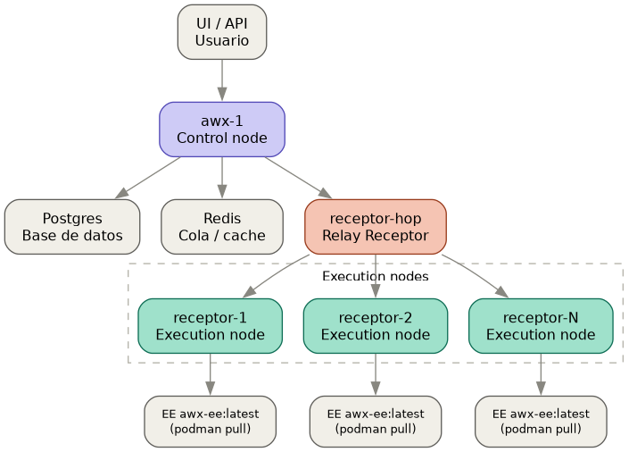

# AWX escalable: control plane + execution nodes + hop (Receptor mesh)

Entorno de **desarrollo** de AWX (repo [ansible/awx](https://github.com/ansible/awx),
rama `devel`) que reproduce el modelo real de escalado de AWX/AAP: un
**control node** que decide/programa trabajo, uno o más **execution
nodes** que lo ejecutan, y un **hop node** de [Receptor](https://github.com/ansible/receptor)
delante de ellos (relay puro, sin Django) — el patrón que usa AAP en
producción cuando el control plane no tiene visibilidad directa de red a
los execution nodes. Es la evolución de [49_awx](../49_awx) (que despliega
todo en un único contenedor "hybrid"); aquí se separa la ejecución en
nodos propios y se puede escalar el número de execution nodes en
caliente.

Todo lo generado aquí (`compose.yaml`, confs de Receptor, topología) sale
del propio tooling de `ansible/awx` (`make docker-compose-sources
CONTROL_PLANE_NODE_COUNT=1 EXECUTION_NODE_COUNT=<N>`), no está inventado
a mano — ver [PLAN.md](PLAN.md) para el detalle de cómo se verificó esto
contra el código real del repo.



(generado con Graphviz a partir de [architecture.dot](architecture.dot):
`dot -Tpng architecture.dot -o architecture.png`)

**Aviso oficial del propio repo**: desplegar desde `devel`/HEAD no es
estable — es la rama de desarrollo activo, no una release.

## Requisito previo: tener la imagen

Para arrancar el ejemplo hace falta la imagen de [.env](.env)
(`AWX_IMAGE`). Dos opciones:

- Ya está publicada en Docker Hub (o ya la tienes en local de una vuelta
  anterior) → ve directo a "1. Lanzar el entorno".
- Hay que construirla desde el código fuente de `ansible/awx` → ve
  primero a la sección "Descarga de fuentes, build y publicación de la
  imagen" más abajo, y vuelve aquí cuando termine.

## 1. Lanzar el entorno

```shell
./00_init.sh              # crea ./volumes y ./secrets.env (contraseñas) si no existen
./01_launch_compose.sh    # docker compose up -d (control + hop + execution nodes + postgres + redis)
./02_create_admin.sh      # fija la password del admin
./08_build_ui.sh          # compila la UI real (solo falta la primera vez)
```

Todos son idempotentes: puedes volver a ejecutarlos sin que rompan nada
si el entorno ya estaba levantado.

- `00_init.sh`: si no existe `secrets.env`, genera contraseñas
  aleatorias (`AWX_PG_PASSWORD`, `AWX_ADMIN_PASSWORD`) y las imprime por
  pantalla; crea `./volumes/awx_db` y `./volumes/redis_socket`; clona la
  imagen y genera `compose.yaml` con la topología de [.env](.env)
  (`AWX_CONTROL_NODE_COUNT`, `AWX_EXECUTION_NODE_COUNT`).
- `01_launch_compose.sh`: `docker compose up -d`. La primera vez tarda
  varios minutos (migraciones de base de datos y bootstrap de
  desarrollo dentro del control node, `awx_1`). Ese bootstrap, además de
  lo de siempre (admin, demo data), **auto-provisiona el hop node y
  todos los execution nodes en AWX** (`awx-manage provision_instance` +
  `register_peers` para cada `receptor-N`) — no hace falta ningún script
  nuestro para eso, es el propio `bootstrap_development.sh` de
  `ansible/awx` el que lo hace, de forma idempotente en cada arranque.
- `02_create_admin.sh`: fija la contraseña del usuario `admin` con
  `awx-manage changepassword admin`, al valor de `secrets.env`
  (`AWX_ADMIN_PASSWORD`).
- `08_build_ui.sh`: igual que en 49 — el bootstrap, si no encuentra un
  build real, genera solo un placeholder de la UI. Este script compila
  la UI real (repo [ansible/ansible-ui](https://github.com/ansible/ansible-ui))
  dentro del control node. Tarda varios minutos.

  > **No lo lances en paralelo con `./10_scale.sh`**: escalar recrea el
  > contenedor `awx_1` (cambia `EXECUTION_NODE_COUNT`), lo que mataría a
  > mitad un build de UI en curso dentro de ese mismo contenedor.

## 2. Acceso

- UI / API: [https://localhost:8143/](https://localhost:8143/)
  (puerto configurable en [.env](.env) como `AWX_HTTPS_PORT`; distinto
  del de 49_awx a propósito, para poder tener ambos ejemplos arriba a la
  vez)
- Login: `admin` / el valor de `AWX_ADMIN_PASSWORD` en `secrets.env`
  (impreso por `./00_init.sh` y recordado por `./01_launch_compose.sh`)

## 3. Escalar

```shell
./10_scale.sh <N>
```

Cambia el número de execution nodes a `N` (`AWX_EXECUTION_NODE_COUNT` en
[.env](.env)), regenera `compose.yaml` y hace `docker compose up -d
--remove-orphans`:

- **Escalar hacia arriba**: solo añade los contenedores `receptor-N`
  nuevos y recrea `awx_1` (cuyo bootstrap los auto-provisiona). Nada más
  que hacer.
- **Escalar hacia abajo**: antes de regenerar nada, el script deprovisiona
  en AWX (`awx-manage deprovision_instance`) los nodos que van a
  desaparecer — si no, quedarían registrados como huérfanos para
  siempre, porque el bootstrap de AWX nunca borra instancias por su
  cuenta.

Verificado en esta misma sesión: `./10_scale.sh 5` (de 3 a 5, los 5
quedan `capacity=1245` cada uno en el grupo `default`) y luego
`./10_scale.sh 2` (de 5 a 2, los 3 retirados dejan de aparecer en
`awx-manage list_instances`, sin huérfanos).

## 4. Probar que reparte trabajo de verdad (jobs Ansible reales)

```shell
./11_prepare_ansible_test.sh   # asegura el "Demo Job Template" y guarda su id
./12_run_ansible_test.sh       # lo lanza vía API, guarda el job id
./13_check_ansible_test.sh     # hace polling hasta estado final y lo valida
```

`13_check_ansible_test.sh` imprime `execution_node` del job para
comprobar en qué nodo corrió, y sale con código de error si el job no
terminó en `successful`.

> **Matiz real, verificado en esta sesión**: el control node (`awx-1`)
> es de tipo `hybrid` y por eso también pertenece al grupo de instancias
> `default` (el mismo donde están los `receptor-N`), compitiendo por
> trabajo igual que ellos — no es "solo decide, nunca ejecuta". En una
> prueba el job corrió en `receptor-1`; en otra, en `awx-1`. Si quisieras
> un control plane que *nunca* ejecute jobs (el modelo puro de
> producción), haría falta sacar `awx-1` del grupo `default` a mano vía
> la API/CLI — no viene así por defecto en este tooling de desarrollo.

## 5. Enlazar explícitamente el Execution Environment

```shell
./14_link_execution_environment.sh
```

AWX registra solo, al arrancar, dos Execution Environments globales
(`AWX EE (latest)` y `Control Plane Execution Environment`, ambos
`quay.io/ansible/awx-ee:latest`) — pero **ni la organización `Default`
ni el `Demo Job Template` los tienen asignados explícitamente**
(`default_environment`/`execution_environment` quedan en `null` en la
API). Los jobs funcionan igual porque AWX cae a un EE global por
fallback, pero en la UI no se ve ningún enganche. Este script:

1. Localiza el id de `AWX EE (latest)`.
2. Lo asigna como `default_environment` de la organización `Default`
   (`PATCH /api/v2/organizations/<id>/`).
3. Lo asigna como `execution_environment` del `Demo Job Template`
   (`PATCH /api/v2/job_templates/<id>/`).
4. Pre-descarga la imagen (`podman pull`) en cada `receptor-N` activo,
   para que el primer job real no tenga que tirar de red.

Verificado en esta sesión: tras ejecutarlo, tanto
`GET /api/v2/organizations/1/` como `GET /api/v2/job_templates/6/`
devuelven el id del EE en vez de `null`. Relanzando el job de prueba
(`./12_run_ansible_test.sh` + `./13_check_ansible_test.sh`) después de
este script, `GET /api/v2/jobs/<id>/` devuelve
`"execution_environment": 1` y `summary_fields.execution_environment.name
== "AWX EE (latest)"` — ya no es el fallback implícito, es el enganche
real.

### Cómo verlo desde la consola web (paso a paso)

**Infrastructure → Entornos de ejecución** (la tabla con `AWX EE
(latest)` / `Control Plane Execution Environment`) **no sirve para
esto** — esa vista es solo el catálogo global de EEs disponibles, no
tiene columna de "quién lo usa". Para confirmar el enganche:

1. Menú lateral → **Trabajos** (`/jobs`).
2. Abre el job más reciente de `Demo Job Template` (el que lanzó
   `./12_run_ansible_test.sh`) — estado **Correcto**.
3. En la pestaña **Details** del job: el campo **Execution Environment**
   debe decir `AWX EE (latest)`, y **Execution Node** debe decir uno de
   los `receptor-N` (no `awx-1`, salvo que te toque el matiz de la
   sección 4).

Alternativa, para ver la *configuración* (no solo el resultado de un job
concreto):

- **Plantillas → Demo Job Template → Details** → campo **Execution
  Environment** = `AWX EE (latest)` (antes de ejecutar el script salía
  vacío).
- **Access Management → Organizaciones → Default → Details** → campo
  **Default Execution Environment** = `AWX EE (latest)` (idem, antes
  vacío).

> **Bug conocido de la rama `devel`, no relacionado con este script**:
> la página `/templates/job-template/<id>/details` puede devolver
> `Bad Request: the permission notification_admin_role is not valid for
> model organization`. En los logs del control node se ve la llamada
> real que lo dispara: `GET /api/v2/organizations/?role_level=notification_admin_role
> => HTTP 400` — es la propia UI (`ansible-ui`) pidiendo un filtro de
> organizaciones por un rol de notificaciones que el backend ya no
> reconoce con ese nombre (desajuste del nuevo sistema RBAC de DAB
> todavía en desarrollo). Confirmado que no afecta a los datos: `GET
> /api/v2/job_templates/<id>/` y `GET /api/v2/organizations/<id>/` —
> las llamadas que de verdad importan — siguen devolviendo `200` con el
> EE correctamente enlazado. Si te lo encuentras, verifica por la
> Opción A (la página de **Trabajos**, que no dispara esa llamada) en
> vez de la de **Plantillas**.

## 6. Gestión del día a día

- `./03_preload_demo_data.sh` — opcional: organización/proyecto/inventario
  demo (ya se carga sola en el primer arranque)
- `./04_ps_compose.sh` — estado de los contenedores (control, hop,
  execution nodes, postgres, redis)
- `./05_logs_compose.sh [servicio]` — logs (`awx_1`, `postgres`,
  `redis_1`, `receptor-hop`, `receptor-1`..`N`)
- `./06_stop_compose.sh` / `./07_start_compose.sh` — parar/arrancar sin
  borrar datos

## 7. Destruir el entorno

```shell
./20_destroy.sh
```

Pide confirmación y hace `docker compose down --remove-orphans` + borra
`./volumes` (datos de postgres y socket de redis) y el directorio
`./awx` clonado (repo + configuración renderizada). **Conserva**
`secrets.env` (mismas credenciales en el próximo `./00_init.sh`; bórralo
a mano si quieres contraseñas nuevas) y **no** borra la imagen ya
publicada en Docker Hub. Irreversible.

---

## Descarga de fuentes, build y publicación de la imagen

Solo hace falta repetir esto cuando quieras una imagen nueva (código
más reciente de `ansible/awx`, o una versión/tag distinta en
[.env](.env)) o cambiar la topología base
(`AWX_CONTROL_NODE_COUNT`/`AWX_EXECUTION_NODE_COUNT` en `.env` antes de
`02_build_image.sh` + `04_generate_compose.sh`; para cambiarla en
caliente sobre un entorno ya levantado usa mejor `./10_scale.sh`, arriba).

### Instalación de software necesario en la máquina (una sola vez)

```shell
./scripts/00_install_prerequisites.sh
```

Con permisos de sudo. Instala `git`, `make`, `python3-pip`, el plugin
`docker compose` y, vía `pip3 --user`, `ansible-core` + las colecciones
`community.docker`, `community.general` y `ansible.posix`. Docker debe
estar ya instalado, con el usuario en el grupo `docker`.

### Clonar/actualizar fuentes, compilar, traducir a compose.yaml y publicar

```shell
./scripts/01_clone_awx_devel.sh    # clona ansible/awx (rama devel) en ./awx, o lo actualiza si ya existe
./scripts/02_build_image.sh        # make docker-compose-build + docker-compose-sources (con la topología de .env), re-etiqueta la imagen
./scripts/04_generate_compose.sh   # traduce el docker-compose.yml generado a nuestro compose.yaml
docker login                       # una sola vez, con tu cuenta de Docker Hub
./scripts/03_push_image.sh         # docker push de la imagen ya etiquetada
```

- `01_clone_awx_devel.sh`: idéntico a 49 — idempotente pero siempre al
  día con origen (`git fetch` + `reset --hard origin/devel` si ya
  existe).
- `02_build_image.sh`: `make docker-compose-build` + `make
  docker-compose-sources CONTROL_PLANE_NODE_COUNT=... EXECUTION_NODE_COUNT=...`
  (variables de `make`, no `-e` de ansible — el propio `Makefile` hace
  esa traducción). Esto renderiza en `awx/tools/docker-compose/_sources/`
  el control, el hop y cada execution node con su conf de Receptor. Fija
  la password de Postgres en `database.py` igual que en 49.
- `04_generate_compose.sh`: traduce ese `docker-compose.yml` generado a
  nuestro `compose.yaml` — re-etiqueta la imagen propia en control y
  execution nodes (el hop conserva `quay.io/ansible/receptor:devel`, no
  es nuestra), reescribe rutas a `./awx`, cambia `postgres` a la imagen
  oficial `postgres:17` con bind a `./volumes/awx_db`, y usa
  `./volumes/redis_socket` en vez de un volumen nombrado. **No editar
  `compose.yaml` a mano** — se regenera entero cada vez.
- `03_push_image.sh`: `docker push`. Requiere `docker login` previo a
  mano.

### Contraseñas: `secrets.env`

Igual que en 49: [.env](.env) es config no sensible y se versiona;
`secrets.env` (gitignorado) tiene `AWX_PG_PASSWORD`/`AWX_ADMIN_PASSWORD`,
generadas por `./00_init.sh` la primera vez.

### Notas

- `awx_1` (control) monta `./awx:/awx_devel` igual que en 49 — sigue
  haciendo falta el repo clonado junto al `compose.yaml`, la imagen no
  es autocontenida.
- Los `receptor-N` (execution) usan la misma imagen devel, pero su
  `command` es solo `receptor --config ...` — no arrancan Django, solo
  el binario de Receptor, que ejecuta los jobs vía `ansible-runner
  worker` usando `podman` (ya incluido en la imagen) para aislar cada
  job en su propio contenedor. Así es como escala AWX de verdad.
- El bind mount de `work_public_key.pem` en cada execution node puede
  acabar como directorio vacío propiedad de `root` (gotcha de Docker al
  montar una ruta que no existe aún) — es inofensivo porque solo se usa
  si `sign_work=true`, que no es nuestro caso; `02_build_image.sh` ya lo
  gestiona sin fallar si eso ocurre.
- `postgres` usa `postgres:17` oficial (no el `quay.io/sclorg/postgresql-15-c9s`
  por defecto). Si cambias de versión mayor, borra `./volumes/awx_db`
  antes de relanzar.
- Puertos de exposición al host (`AWX_HTTP_PORT`, `AWX_HTTPS_PORT`,
  `AWX_UI_DEV_PORT`, `AWX_PG_PORT` en `.env`) están reescritos respecto a
  los literales que trae la plantilla de `ansible/awx`, para poder
  convivir con otros servicios del host y con el ejemplo 49 a la vez.
